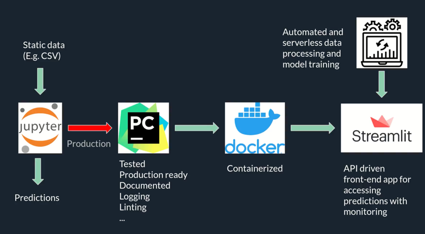
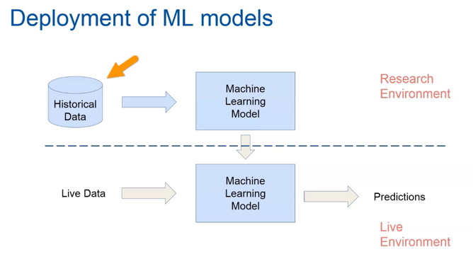

# Model Deployment

## research and production environments.

The term environment refers to the setting or the state of a computer where software or other products.

- The research environment is a setting that contains the tools, programs and software that are suitable
for data analysis, pre-processing and the development of machine learning models.
  
- The production environment is a real time setting, with running programs and hardware setups that allow the organizations' daily operations. In the production environment is where the machine learning models are actually available for business use. Through the production environment, we make machine learning models available to provide.

## Containerize Your Code - Docker
- Build once and deploy everywhere